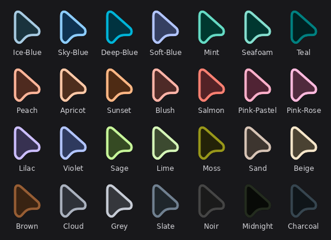
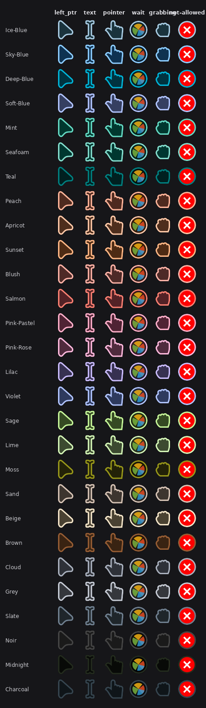

<div align="center">

<picture>
  <source media="(prefers-color-scheme: dark)" srcset="docs/logo-dark.png">
  
</picture>

</div>

# Material Bibata Cursor

28 Bibata cursor themes, colored using Material Design 3's tonal
system — a dark body paired with a vibrant accent outline, tuned
independently per theme.

Pick whichever variant fits your setup, or add your own color — see
[Adding a color](#adding-a-color) below.

<div align="center">



</div>

## Themes

Ice Blue, Sky Blue, Deep Blue, Soft Blue, Mint, Seafoam, Teal, Peach,
Apricot, Sunset, Blush, Salmon, Pink Pastel, Pink Rose, Lilac, Violet,
Sage, Lime, Moss, Sand, Beige, Brown, Cloud, Grey, Slate, Noir,
Midnight, Charcoal. Exact hex values are in `themes.json`.

There's also **Classic** — the original stock Bibata-Modern-Classic
colors (`#000000` body, `#ffffff` outline), included as-is for anyone
who wants the vanilla look rather than an M3 variant. It's not one of
the 28 (it doesn't follow the Container/Primary design this project is
actually about), just a convenient extra in the same pack.

Each theme's actual range of cursor shapes:

<div align="center">



</div>

## Install

Needs `fish`, `git`, `python3`, `jq`, plus whatever `bibata_cursor`
itself needs to build (`librsvg`, `xorg-xcursorgen` — see
[rtgiskard/bibata_cursor](https://github.com/rtgiskard/bibata_cursor)).

```bash
git clone https://github.com/SakibShahariar/material-bibata-cursor
cd material-bibata-cursor
fish scripts/compile_bibata_material.fish
```

That installs all 28 to `~/.icons`. From there, pick one through GNOME
Settings, GNOME Tweaks, or however your desktop/WM selects a cursor
theme — the exact menu depends on your setup.

Don't want to run fish directly? There's a `justfile`:

```bash
just build              # all 28
just build-one Coral    # just one, faster for testing a color
just package <version>  # bundle for a release, e.g. just package v1.0.0
just list
just show Ice-Blue
just check-deps
```

## Adding a color

Add an entry to `themes.json`:

```json
"Coral": {
  "body": "#4e2418",
  "primary": "#ff7f50",
  "watch": "#2e130a"
}
```

Then `fish scripts/compile_bibata_material.fish Coral` (or
`just build-one Coral`) to build just that one instead of all 28.

A few guidelines for picking colors that hold up visually:

- **Body**: dark, desaturated, roughly 10-25% lightness. This is the
  neutral fill, not a darker copy of your accent.
- **Primary**: the vibrant one. This carries the actual color.
- **Watch**: near-black, just needs to sit behind the outline.

Preview it with `gsettings set org.gnome.desktop.interface cursor-theme
Bibata-Material-Coral`, or `hyprctl setcursor Bibata-Material-Coral 24`
on Hyprland.

---

## Why body and primary are separate colors

Most themed-cursor setups just take an accent color and darken it for
the body. That works fine against some wallpapers and falls apart
against others — low contrast, hard to spot the cursor at all.

This project picks body and primary independently instead, following
Material Design 3's Container/Primary roles:

| M3 Role | Cursor part | What it does |
|---|---|---|
| Container | Body | Dark, desaturated fill. Stays legible regardless of how bright or saturated the accent is. |
| Primary | Outline | The actual accent color — vibrant, high-chroma. |

For Ice Blue:

```
Body    (Container) : #1a333d
Primary (Outline)   : #a8cbe2
Watch               : #0a1f26
```

This keeps contrast consistent across all 28 themes, regardless of how
saturated or pastel the accent color is.

---

## Files

```
themes.json                       # all theme colors, edit this to add/change one
scripts/
├── compile_bibata_material.fish  # builds themes.json -> ~/.icons
├── metadata_generator.py         # writes index.theme so GNOME picks it up
└── package_release.sh            # bundles compiled themes for release
```

Build flow: clone `bibata_cursor`, patch its render config with each
theme's colors, then compile and install to `~/.icons`. `index.theme`
gets written right after each theme installs, so a broken metadata
file gets caught immediately instead of at the end of a 28-theme run.

Cursors are also compiled at more sizes than upstream's default (19
sizes instead of 11) — specifically every exact size a 24px cursor
hits across Plasma/GNOME's fractional display scaling steps (0.5x
through 3x). Without an exact match, some apps scale the nearest
available bitmap instead, which can look blurry on fractional scaling.
This roughly doubles build time (~30s vs ~17s per theme) but doesn't
change anything about how you use the themes.

## Packaging for redistribution

If you want to share compiled themes somewhere as a single download
(a GitHub Release, GNOME-Look.org, wherever) instead of having people
clone and build the repo themselves, package what you've built:

```bash
bash scripts/package_release.sh <version>
```

Writes `dist/bibata-material-<version>.tar.gz` from whatever's
compiled in `~/.icons`, with a plain-language `INSTALL.txt` inside for
anyone who downloads the archive directly and never sees this repo.
This step is entirely optional — it's only for packaging a downloadable
copy, not part of building or using the themes yourself.

To leave specific themes out of the package (e.g. `Classic`, since
it's not one of the 28 M3 themes):

```bash
bash scripts/package_release.sh <version> --exclude Classic
```

Comma-separate multiple names to exclude more than one:
`--exclude Classic,Noir`.

---

## Matugen Setup

To make these themes work with [matugen](https://github.com/InioX/matugen) put `scripts/cursor_matugen.sh`, `scripts/themes.json` and `scripts/color_match.py` in your `~/.config/matugen/post-hook-scripts/` folder. Then inside your `~/.config/matugen/config.toml` file add

```toml
[templates.cursor]
input_path = "~/.config/matugen/templates/cursors.json"
output_path = "~/.config/colors.json"
post_hook = "~/.config/matugen/post-hook-scripts/cursor_matugen.sh"
```

then inside the `~/.config/matugen/templates/` folder create `cursors.json` with this

```json
{
    "colors": {
        "color13": "{{colors.primary.default.hex}}"
    }
}
```
Then running matugen command will do the job

## License

Scripts and `themes.json` in this repo are MIT — see `LICENSE`.

The compiled cursor themes are a different story: they're derivative
of [Bibata_Cursor](https://github.com/rtgiskard/bibata_cursor), which
is GPLv3-or-later. If you redistribute compiled themes, that's under
GPLv3, not this repo's MIT license. Not legal advice — check the GPLv3
text if you need to know exactly what that means for your situation.
