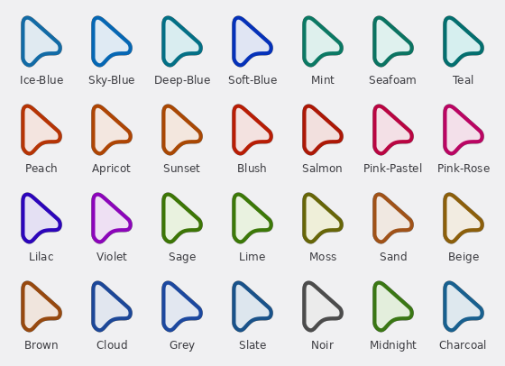
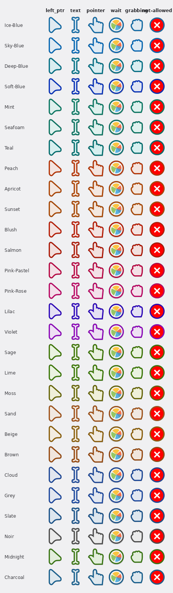

<div align="center">

<picture>
  <source media="(prefers-color-scheme: dark)" srcset="docs/logo-dark.png">
  
</picture>

</div>

# Material Bibata Cursor

57 Bibata cursor themes (28 dark + 28 `-Light` + the original Classic),
colored using Material Design 3's tonal system — a dark body paired
with a vibrant accent outline, tuned independently per theme.

Whatever your setup — X11, Wayland, GNOME 51+, KDE Plasma 6.2+, Hyprland,
or Windows — a single theme folder contains the format it needs. Pick a
variant below, or add your own color — see
[Adding a color](#adding-a-color).

<div align="center">

[](https://github.com/SakibShahariar/material-bibata-cursor/releases/latest)
[](LICENSE)

</div>

## Contents

[Themes](#themes) · [Install](#install) · [SVG cursors](#svg-cursors) ·
[Windows cursors](#windows-cursors) · [Adding a color](#adding-a-color) ·
[Why body and primary are separate colors](#why-body-and-primary-are-separate-colors) ·
[Files](#files) · [Packaging for redistribution](#packaging-for-redistribution) ·
[Matugen Setup](#matugen-setup) · [License](#license)

Prefer a download over building from source? Grab the latest
[release](https://github.com/SakibShahariar/material-bibata-cursor/releases/latest) —
every archive ships all formats (Xcursor bitmaps, Hyprcursor, scalable SVG
for GNOME 51+ / KDE 6.2+, and Windows `.cur`/`.ani`) plus an `INSTALL.txt`.

<div align="center">


</div>

## Themes

Ice Blue, Sky Blue, Deep Blue, Soft Blue, Mint, Seafoam, Teal, Peach,
Apricot, Sunset, Blush, Salmon, Pink Pastel, Pink Rose, Lilac, Violet,
Sage, Lime, Moss, Sand, Beige, Brown, Cloud, Grey, Slate, Noir,
Midnight, Charcoal. Exact hex values are in `themes.json`.

There's also **Classic** — the original stock Bibata-Modern-Classic
colors (`#000000` body, `#ffffff` outline), included as-is for anyone
who wants the vanilla look rather than an M3 variant. It's not one of
the 28 (it doesn't follow the Container/Primary design this project is
actually about), just a convenient extra in the same pack.

Each theme's actual range of cursor shapes:

<div align="center">


</div>

### Light versions

Every one of the 28 also has a `-Light` counterpart (e.g. `Ice-Blue-Light`)
— same hue, tone-swapped: a pale/light body instead of a dark one, and a
darker, saturated outline instead of a light one. This mirrors how
Material Design 3 actually defines light vs dark surfaces (it's not a
simple color inversion — light and dark mode swap which tone from the
same palette plays which role). All 28 light variants meet the same
≥4.5 contrast bar as the dark set.

<div align="center">



</div>

Each light theme's range of cursor shapes:

<div align="center">



</div>

## Install

Needs `fish`, `git`, `python3`, `jq`, plus whatever `bibata_cursor`
itself needs to build (`librsvg`, `xorg-xcursorgen` — see
[rtgiskard/bibata_cursor](https://github.com/rtgiskard/bibata_cursor)).

```bash
git clone https://github.com/SakibShahariar/material-bibata-cursor
cd material-bibata-cursor
fish scripts/compile_bibata_material.fish
```

That installs all 57 (28 dark, 28 light, plus Classic) to `~/.icons`.
Each theme also gets a `cursors_scalable/` SVG export written to
`~/.local/share/icons` (override with `BIBATA_MATERIAL_SCALABLE_DIR`).
That's the format KDE Plasma 6.2+ and **GNOME 51+** actually render in
the compositor — see [SVG cursors](#svg-cursors) below.
The same build also produces `hyprcursors/` for Hyprland, so a single
install covers X11 apps (`cursors/`), GNOME/KDE (the SVGs), and
Hyprland (`hyprctl setcursor Bibata-Material-<Name> 24`).
From there, pick one through GNOME Settings, GNOME Tweaks, or however
your desktop/WM selects a cursor theme — the exact menu depends on
your setup.

Don't want to run fish directly? There's a `justfile`:

```bash
just build              # all 57 (28 dark, 28 light, Classic)
just build-dark         # just the 28 dark themes + Classic
just build-light        # just the 28 light themes
just build-one Apricot  # just one, faster for testing a color
just svg                # (re)generate SVG cursors for installed themes
just svg-one Apricot    # SVG cursors for just one theme
just package <version>  # bundle for a release, e.g. just package v1.0.0
just package-win <version>       # Windows .cur/.ani .zip archives
just list
just show Apricot
just check-deps
```

For finer control (e.g. skipping specific themes, or combining
`--only-light`/`--only-dark` with `--exclude`), call the fish script
directly: `fish scripts/compile_bibata_material.fish --only-light
--exclude Noir-Light,Charcoal-Light`.

## SVG cursors

KDE Plasma 6.2+ and GNOME 51+ render cursor *SVGs* instead of bitmaps:
they expect a `cursors_scalable/<shape>/metadata.json` tree, where each
shape folder holds SVG frames plus a tiny JSON file listing them with
their hotspot. GNOME's compositor (GNOME Shell `st-cursor.c`) only
scans the XDG icon dirs (`~/.local/share/icons`, `/usr/local/share/icons`,
`/usr/share/icons`) — `~/.icons` is never scanned, which is why the SVGs
land in the XDG tree instead of next to the Xcursor pack.

`generate_svg_cursors.py` builds that tree straight from Bibata's SVG
sources (same group/color logic the compile step uses):

- one real directory per cursor shape, named by its X11 name (what KDE
  and X11 apps request), and
- symlinked directories for the CSS cursor names **GNOME/Mutter** looks
  up (`default`, `pointer`, `text`, `ew-resize`, ...), mapped onto the
  same shapes the Xcursor bitmap theme uses, so both renderers draw the
  same arrows (e.g. GNOME's `text` maps to the same `xterm` shape).

The animated `wait`/`left_ptr_watch` cursors keep their 54 frames with a
40ms delay. `nominal_size` is 256 to match Bibata's SVG canvas, so
hotspots and scaling are identical to the bitmap theme's.

If you'd installed themes before SVG export existed, there's nothing to
undo: `just svg` regenerates the scalable tree without recompiling
anything (it only touches `cursors_scalable/`; the Xcursor fallback and
`index.theme` of each theme in `~/.local/share/icons` are symlinked to
the compiled pack).

Cursors are also compiled at more sizes than upstream's default (19
sizes instead of 11) — specifically every exact size a 24px cursor
hits across Plasma/GNOME's fractional display scaling steps (0.5x
through 3x). Without an exact match, some apps scale the nearest
available bitmap instead, which can look blurry on fractional scaling.
This roughly doubles build time (~30s vs ~17s per theme) but doesn't
change anything about how you use the themes.

## Windows cursors

Windows `.cur`/`.ani` cursor files are generated separately using
`scripts/build_windows.py`:

```bash
python3 scripts/build_windows.py            # all themes
python3 scripts/build_windows.py --only-dark # dark themes only
python3 scripts/build_windows.py --only-light # light themes only
```

Each theme gets a folder under `out_win/` containing a `.cur` file
(16, 24, 32, 48, 64, and 128px) for every static cursor, plus two
animated `.ani` files — `wait.ani` (Busy) and `left_ptr_watch.ani`
(Work) — so the spinner actually spins, reusing the same 54-frame
animation and timing as the Linux cursor.

To install on Windows, open any `Bibata-Material-*` folder, right-click
`Install.inf` and choose **Install** — it copies the `.cur` and `.ani`
files into a per-theme `C:\Windows\Cursors\<theme>\` subfolder and
registers the scheme in the registry, so multiple themes can be
installed side by side (admin prompt). Alternatively copy the theme
folder into `%LOCALAPPDATA%\Icons\` (per-user, no admin) and set the
cursors in **Settings → Devices → Mouse → Additional mouse settings →
Pointers**.

Bundling these into distributable `.zip` archives is covered in
[Packaging for redistribution](#packaging-for-redistribution) below.

## Adding a color

Add an entry to `themes.json`:

```json
"Coral": {
  "body": "#4e2418",
  "primary": "#ff7f50",
  "watch": "#2e130a"
}
```

Then `fish scripts/compile_bibata_material.fish Coral` (or
`just build-one Coral`) to build just that one instead of recompiling
everything.

A few guidelines for picking colors that hold up visually:

- **Body**: dark, desaturated, roughly 10-25% lightness. This is the
  neutral fill, not a darker copy of your accent.
- **Primary**: the vibrant one. This carries the actual color.
- **Watch**: near-black, just needs to sit behind the outline.

Preview it with `gsettings set org.gnome.desktop.interface cursor-theme
Bibata-Material-Coral`, or `hyprctl setcursor Bibata-Material-Coral 24`
on Hyprland.

---

## Why body and primary are separate colors

Most themed-cursor setups darken a single accent color and call it a
day — fine against some wallpapers, invisible against others. Picking
body and primary independently (M3's Container/Primary roles) keeps
the cursor legible no matter how bright or saturated the accent is:

| M3 Role | Cursor part | What it does |
|---|---|---|
| Container | Body | Dark, desaturated fill. Stays legible regardless of how bright or saturated the accent is. |
| Primary | Outline | The actual accent color — vibrant, high-chroma. |

For Ice Blue: `Body #1a333d` · `Primary #a8cbe2` · `Watch #0a1f26`.

The same treatment is applied to every palette, so contrast stays
consistent across all 28 themes.

---

## Files

```
themes.json                       # all theme colors, edit this to add/change one
scripts/
├── bibata_cursor/                # build dependency, cloned on first build
├── compile_bibata_material.fish  # builds themes.json -> ~/.icons (Xcursor + Hyprcursor)
├── metadata_generator.py         # writes index.theme so GNOME picks it up
├── generate_svg_cursors.py       # writes cursors_scalable/ SVG cursors
├── build_windows.py              # Windows .cur/.ani themes (see "Windows cursors")
├── color_match.py                # finds the closest theme color to a hex
├── cursor_matugen.sh             # matugen post-hook (see "Matugen Setup")
└── package_release.sh            # bundles compiled themes for release
```

Build flow: clone `bibata_cursor`, patch its render config with each
theme's colors, then compile and install to `~/.icons` (Xcursor
`cursors/` + Hyprland `hyprcursors/`). `index.theme` gets written right
after each theme installs, so a broken metadata file gets caught
immediately instead of at the end of a 28-theme run. Then the same SVG
sources are recolored again into a `cursors_scalable/` tree under
`$XDG_DATA_HOME/icons`.

## Packaging for redistribution

If you want to share compiled themes somewhere as a single download
(a GitHub Release, GNOME-Look.org, wherever) instead of having people
clone and build the repo themselves, package what you've built:

```bash
bash scripts/package_release.sh <version>                     # Linux tar.gz
bash scripts/package_release.sh <version> --win               # Windows .zip
bash scripts/package_release.sh <version> --win --only-dark
bash scripts/package_release.sh <version> --win --only-light
```

Writes two separate Linux archives (dark/light) by default:

- `dist/bibata-material-dark-<version>.tar.gz` — the 28 dark themes + Classic
- `dist/bibata-material-light-<version>.tar.gz` — the 28 `-Light` themes

Each theme folder in an archive contains every format: the Xcursor
`cursors/` tree from the install dir, the Hyprland `hyprcursors/`, and
the scalable `cursors_scalable/` SVGs (merged from `$XDG_DATA_HOME/icons`,
or skipped when it's the same system-wide install dir). So a single
archive works on any desktop: X11 apps use `cursors/`, Hyprland uses
`hyprcursors/`, KDE Plasma 6.2+ and GNOME 51+ use `cursors_scalable/`.

With `--win`, outputs Windows `.zip` archives instead (built from the
`out_win/` output of the [Windows cursors](#windows-cursors) step):

- `dist/bibata-material-dark-<version>-win.zip` — dark themes as `.cur`/`.ani` files
- `dist/bibata-material-light-<version>-win.zip` — light themes as `.cur`/`.ani` files

Each archive contains its own plain-language `INSTALL.txt` (which lists
both the `~/.icons` and `~/.local/share/icons` copy steps for the SVG
cursors, plus the Windows right-click `Install.inf` flow). Use
`--only-dark`, `--only-light`, or `--exclude` to filter themes.
This step is entirely optional — it's only for packaging downloadable
copies, not part of building or using the themes yourself.

To leave specific themes out (e.g. `Classic`, since it's not one of
the 28 M3 themes — this only affects the dark archive):

```bash
bash scripts/package_release.sh <version> --exclude Classic
```

Comma-separate multiple names to exclude more than one:
`--exclude Classic,Noir`.

---

## Matugen Setup

Get a theme that matches your wallpaper with
[matugen](https://github.com/InioX/matugen) and the included post-hook:

1. Copy `scripts/cursor_matugen.sh`, `scripts/color_match.py`, and the
   repo's root `themes.json` (looked up next to the script) into
   `~/.config/matugen/post-hook-scripts/`.
2. Add the template to `~/.config/matugen/config.toml`:

```toml
[templates.cursor]
input_path = "~/.config/matugen/templates/cursors.json"
output_path = "~/.config/colors.json"
post_hook = "~/.config/matugen/post-hook-scripts/cursor_matugen.sh"
```

3. Create `~/.config/matugen/templates/cursors.json` with:

```json
{
    "colors": {
        "color13": "{{colors.primary.default.hex}}"
    }
}
```

A normal `matugen` run then picks your wallpaper's primary color, finds
the closest built-in theme via `color_match.py`, and rebuilds it with
`cursor_matugen.sh`.

## License

Scripts and `themes.json` in this repo are MIT — see `LICENSE`.

The compiled cursor themes are a different story: they're derivative
of [Bibata_Cursor](https://github.com/rtgiskard/bibata_cursor), which
is GPLv3-or-later. If you redistribute compiled themes, that's under
GPLv3, not this repo's MIT license. Not legal advice — check the GPLv3
text if you need to know exactly what that means for your situation.